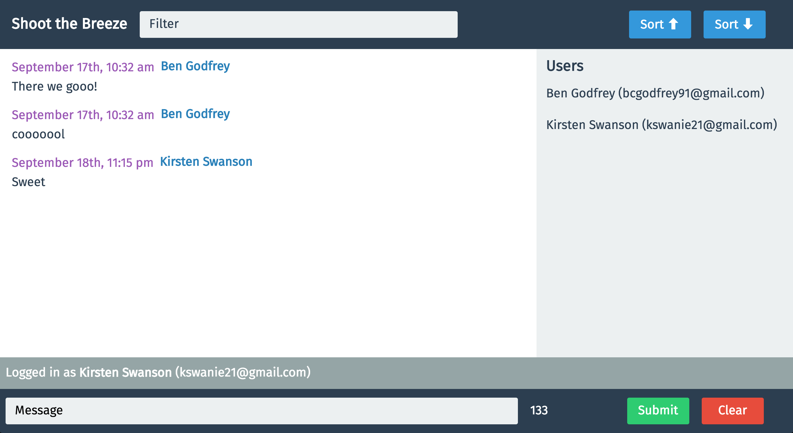

# Shoot The Breeze

[Firebase Shoot the Breeze App](https://shoot-the-breeze-99d6f.firebaseapp.com/)

A chat application made with React and Firebase. The user can store their messages in Firebase. Upon login the previously sent messages to Firebase can be viewed from the login screen. There is a max of 140 characters that can be submitted per message. By default the messages are sorted chronologically, but can be reversed with the sort buttons. There is a sidebar that lists the users and by clicking on the individual users you can just view their messages. On the top there is a filter, which allows you to search through the messages by content, email, or user name. Enzyme testing was utilized to test React components.
